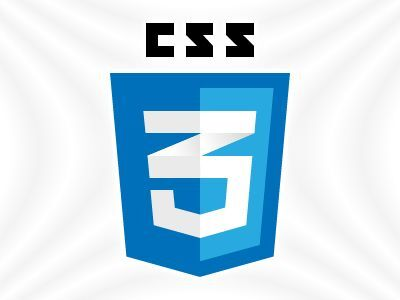

# 🎯 Practice Vanilla CSS

A growing collection of beginner-friendly HTML & CSS mini challenges.
<div align="start">
  
</div>

## 👤 Who is this repo for?

This repo is made for **anyone who wants to practice pure CSS**, especially:

- 👶 Beginners  
- 🧑‍💻 Lower-intermediate learners  
- 🎯 Developers wanting to sharpen their fundamentals  

These tailored mini-challenges help you **test and improve your layout, positioning, and styling skills** using nothing but CSS and HTML.

Anyone interested in contributing new quality challenges or fixing any bugs will be **much appreciated**!

---

## 🛠️ How to fork and use the repo locally

1. Click the **Fork** button at the top-right of this repo.
2. Clone your forked version into your local machine:
   ```bash
   git clone https://github.com/your-username/practice-vanilla-CSS-with-mini-challenges.git
   ```
3. Open the folder with your preferred code editor (e.g., **VS Code**):
```bash
cd practice-vanilla-CSS-with-mini-challenges
```

---

## 🚀 How do I use this repo for practice?
The repo contains:
- Multiple individual project folders.
- Category folders (e.g., buttons/, flags/, etc.).

Though each project folder follows this same structure:
```
Archery Target/
├── preview/   → Contains a visual reference:
│    ├── preview.png/jpeg (for static layouts)
│    └── preview.gif/mp4  (for animated/dynamic layouts)
├── starter/   → This is where you’ll code. Starter HTML + assets are here.
├── solution/  → Full completed solution for reference.
```
### 🧪 Suggested Workflow:
1. **Open a project folder** of your choice.
2. Look at the preview (*.png, .gif, or .mp4*) to get a visual understanding about the layout you need to implement.
3. Go into the **starter** folder:
- open projectName.html.
- read any notes or comments.
- use the provided assets (images, fonts, etc.) given in the sperate folder.
- start coding the layout using only HTML + CSS.

Once done, compare your solution with the **solution/ folder**.

---

## 🤝 How to contribute
Want to add a challenge or fix something?

### ✔️ Contribution Guidelines:
- Make sure your challenge is focused solely on vanilla CSS (no JS).
- Follow the standard folder structure (preview/, starter/, solution/).
- Use clear, descriptive folder names.
- Add a **preview.gif** or **preview.png** for dynamic/static layouts. Use free online tools like [Bowserframe- browser preview from screenshots](https://browserframe.com/) or [CloudConvertGif- screen recondings to gif](https://cloudconvert.com/mp4-to-gif).
- *Optional: Add instructions inside starter/project.html or in a sperate markdown file*.

---

## 📦 How to submit:
1. **Fork** the repo.
2. Create a new branch:
```bash
git checkout -b add-new-challenge
```
3. **Commit** and push your changes.
4. Open a **Pull Request** with a short description.

---

## 📬 Where to find me?
Feel free to reach out or follow for updates:
- GitHub: [masuten11](https://github.com/masuten11)
- Email: m4suten11@gmail.com
- X: [Masuten11](https://x.com/Masuten11)


**That's For Now. Happy practicing! 🎉**
